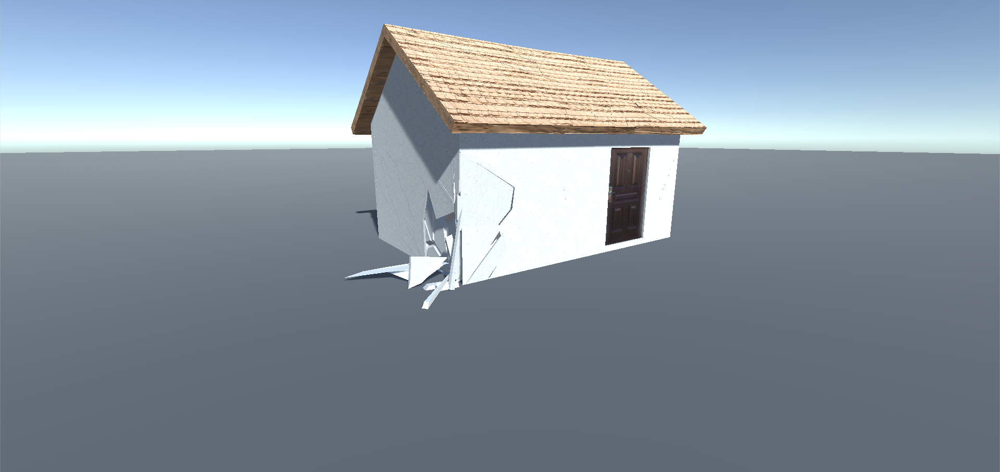
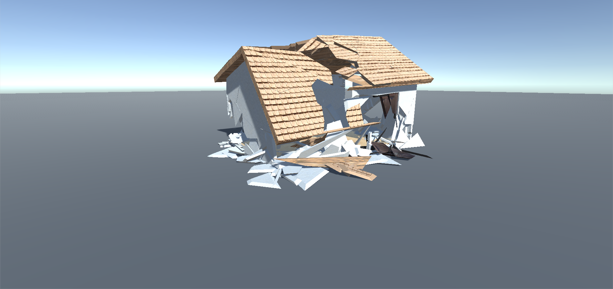
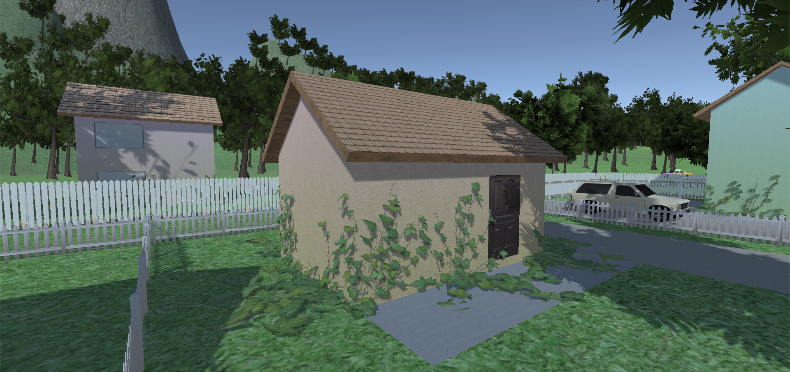
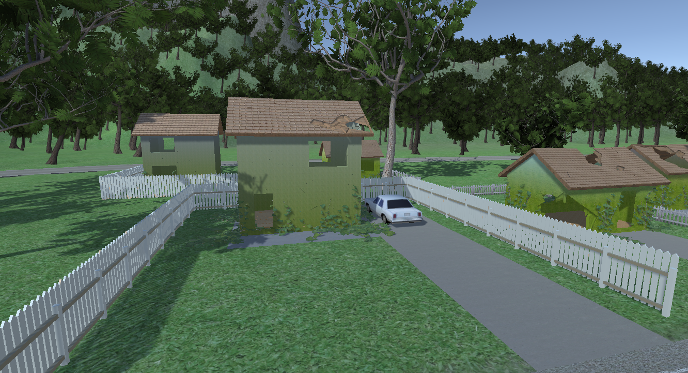

### Description: ###
Application which simulates the decay of buildings and vegetation overgrowth in case of human extinction. Made using Unity Engine.

Buildings will be decayed over time. Each triangle of the affected building's mesh will be partitioned using [Voronoi diagrams](https://en.wikipedia.org/wiki/Voronoi_diagram). Each Voronoi fragment will be transfromed into a [Frustum](https://en.wikipedia.org/wiki/Frustum) and will be connected to its neighbours using [Unity's Hinge Joint](https://docs.unity3d.com/Manual/class-HingeJoint.html) to simulate realistic physics. Fragments will be kept in an [undirected graph](https://en.wikipedia.org/wiki/Graph_(discrete_mathematics)#Undirected_graph). Buildings' decay consists of choosing fragments from the graph (at random times and in a certain radius), removing them from the graph and letting the physics engine do the rest of the work. Also, each time a fragment is removed, a [flood fill](https://en.wikipedia.org/wiki/Flood_fill) will occur to unsure that unconnected graphs will be removed. Fragments fallen fragments will be deleted after a certain ammount of time.

For vegetation overgrowing, [Hedera](https://github.com/radiatoryang/hedera) was used to grow ivy arround the buildings at a certain interval. The library was modified to also work not only in the editor. Moss growth was simulated using a simple shader which blends the buildings' textures and a seamless moss texture. The moss will grow from the bottom to the top at a certain rate specified in the shader paramters. Also, some trees will swap their models to ones in future growth states.

### Screenshots: ###

### References: ###
Thomas Luft (2007). Ivy Generator. <http://www.ivy-generator.com/>\
OskarSigvardsson (2017). Voronoi destruction effect. <https://github.com/OskarSigvardsson/unity-delaunay>\
radiatoryang, yangrobertw, LostEarth (2019). Hedera. <https://github.com/radiatoryang/hedera>\
danbystrom (2019). ScamScatter. <https://github.com/danbystrom/ScamScatter>
